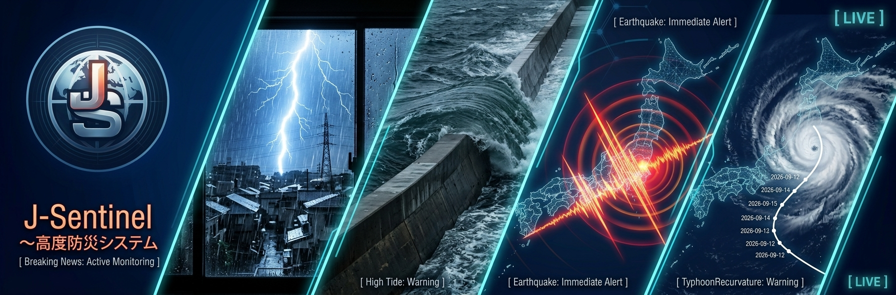

<div align="center">
  
  <h1>J-Sentinel ～ 高度防災システム (v1.3.0)</h1>
  <p><strong>高度防災情報インジェスト・マルチプラットフォーム配信・対話型ボット統合オーケストレーターシステム</strong></p>
</div>

---

## 📥 ダウンロード

最新のフルシステム版パッケージ（コアエンジン、マルチ配信モジュール、対話型ボット、GUIマネージャー同梱）は、以下のリンクからダウンロードできます。

👉 **[J-Sentinel-FullSystem_v1.3.0.zip をダウンロード](https://github.com/MustangTIS/J-Sentinel/releases/download/v1.3.0/J-Sentinel-FullSystem_v1.3.0.zip)**

---

## 📖 フルシステム使い方マニュアル

現在のフルシステムの使い方は公式サイトのマニュアルから。

👉 **[公式マニュアルページ](https://mustangtis.wjg.jp/J-Sentinel/)**

---


## 📋 概要

**J-Sentinel** は、気象庁が公開する公式オープンデータ（地震、津波、気象警報、各種防災情報など）を定期ポーリングによってローカルストレージへインジェスト（取得・蓄積）し、さらに **Discord、Slack、Matrix、Bluesky** などのマルチプラットフォームへ自動プッシュ通知配信、および **Discord / Matrix ボットによる対話型の気象・警報情報照会** を行うための高度防災システムです。

非公式APIに依存せず、気象庁の一次ソースからクリーンかつ安全にデータを取得する「コアエンジン」と、それを拡張・通知・対話化する「フルシステム」を一つに統合したパッケージとして提供しています。

---

## 📁 ディレクトリ構造

本パッケージには、コアエンジン単体と、マルチ通知・対話型ボット・GUI設定マネージャーを含むフルシステム版が同梱されています。

```text
\GitHub\J-Sentinel\
  ┣ Asset/
  ┃   ┗ icon.jpg              # システムアイコン
  ┣ J-Sentinel-Core/          # コア・インジェストシステム単体
  ┃   ┣ codemaster/           # 振り分けルール・地域コード辞書 (CSV)
  ┃   ┣ database/             # 取得したJSONデータや同期時刻ファイル（※実行時に自動生成）
  ┃   ┣ config.json           # コア動作設定ファイル
  ┃   ┣ run_sentinel.py       # メイン・オーケストレーター（常駐ランナー）
  ┃   ┣ core-runner.bat       # ランナー起動用バッチ
  ┃   ┣ js_gui_setup.py       # GUI設定管理・マスター編集ツール
  ┃   ┗ setup-gui.bat         # コア用GUI設定起動バッチ
  ┗ J-Sentinel-FullSystem/    # フルシステム版（マルチ配信・GUI・Bot統合）
      ┣ config.json           # システム全体設定（トークン・配信先等）
      ┣ setup-gui.bat         # GUI設定・マルチ配信先マネージャー起動用バッチ
      ┣ core-runner.bat       # システム全体の統合起動用バッチ
      ┣ J-sentinel.bat        # メイン・プッシュ通知システム起動用バッチ
      ┣ bot.bat               # 対話型チャットボット (Discord/Matrix) 起動用バッチ
      ┣ J-Sentinel_main.py    # メイン・オーケストレーター
      ├─ system/              # システム中核モジュール群
      │   ┣ config_manager.py # 設定ファイル読み込み・環境検証
      │   ┣ log_monitor.py    # 監視ディレクトリの非同期ファイルウォッチャー
      │   ┣ info_parser.py    # 気象情報・特別警報等の汎用パーサ
      │   ┣ quake_parser.py   # 地震・津波・遠地地震情報 パーサ＆震度ソート
      │   ┣ volcano_parser.py # 火山噴火警報・予報パーサ＆カラーマップ制御
      │   ┗ senders.py        # マルチプラットフォーム配信司令塔
      ├─ bot/                 # 対話型ボットモジュール群
      │   ┣ discord_bot.py    # Discord インタラクティブ・コールバックボット
      │   ┣ matrix_bot.py     # Matrix インタラクティブ・コールバックボット
      │   ┣ warning_parser.py # 気象警報・注意報JSON パーサ＆地域検索（レベル別グルーピング対応）
      │   ┣ weather_parser.py # 天気予報JSON パーサ (Discord Embed用)
      │   ┗ weather_parser_matrix.py # 天気予報JSON パーサ (Matrix用)
      └─ js_core/             # コアインジェストモジュール群